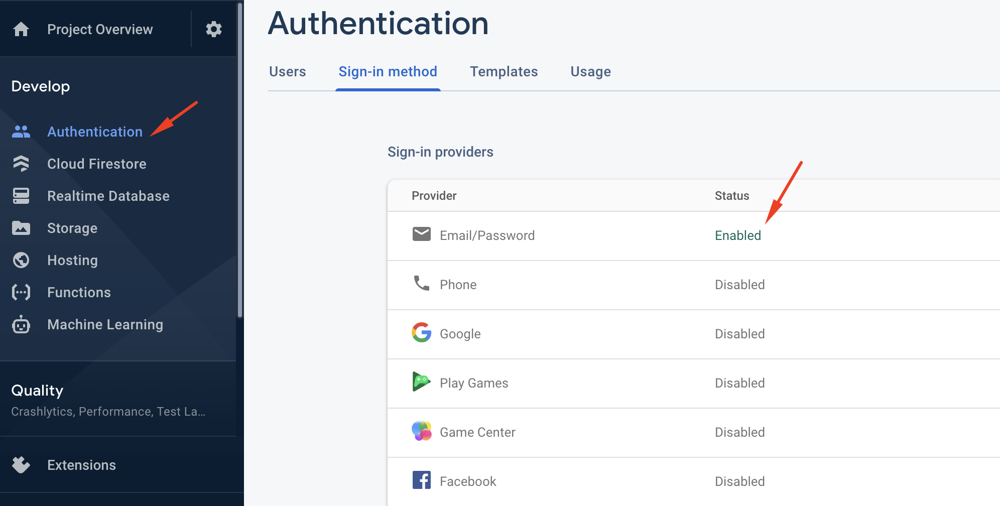

Firebase is a subsidiary of google cloud

**Cons**

It's quite hard to wrap your head around it if you comes from sql databases

Its quite hard to migrate to other services

**Pro**

Pay as you go Firebase is cheap, google has.

Scaling,no need to handle aws and docker.

1. Install CRA & Create firebase project, then go to firebase console and create new project.

```jsx
npx create-react-app learnfirebase
```

2.  Install firebase, create firebase.js for initialization & environtment file for storing config

```jsx
npm i firebase

touch .env.local

//create firebase.js
touch src/firebase.js

// Get your config from firebase console and place it in .env.local
// add REACT_APP in front of the variable;
// that way we can utilize built-in Custom Environment Variables from Create React App
// don't forget to remove the coma
// if you modify .env.local while running the server, you need to restart it in order for the changes to takes effect.

  REACT_APP_apiKey= "AIzaSyDAy8Sw2323dfspRt2SyV6w_HfWC4hDt4u4"
  REACT_APP_authDomain= "misdfsd627.firebaseapp.com"
  REACT_APP_databaseURL= "https://masdas627.firebaseio.com"
  REACT_APP_projectId= "mailaas-ef627"
  REACT_APP_storageBucket= "millasdie-ef627.appspot.com"
  REACT_APP_messagingSenderId= "330asd9988281"
  REACT_APP_appId= "1:330139988281:asdas60581ca42778e8"

//Don't worry this is not a valid credential.
```

3. Initialize firebase

```jsx
//firebase.js
import firebase from "firebase/app"
import "firebase/auth"

const firebaseConfig = {
  apiKey: process.env.REACT_APP_apiKey,
  authDomain: process.env.REACT_APP_authDomain,
  databaseURL: process.env.REACT_APP_databaseURL,
  projectId: process.env.REACT_APP_projectId,
  storageBucket: process.env.REACT_APP_storageBucket,
  messagingSenderId: process.env.REACT_APP_messagingSenderId,
  appId: process.env.REACT_APP_appId,
}

// create a variable to store the initialized state of firebase, and pass the config as param
const firebaseApp = firebase.initializeApp(firebaseConfig)

// create a variable to store auth
export const auth = firebaseApp.auth()
```

## Authentication

The following is just my notes while learning and playing around with firebase auth. I try to make the code as minimal as possible.

Before we start enable email sign-in method in firebase console



```jsx
User Signup

// App.js
// minimal example of signup without using form and error handling
// go ahead and click Sign Up,
//you should see trial@gmail.com at your firebase console if everything is correct
// createUserWithEmailAndPassword is just one of many methods that firebase provides
// for example to sends a password reset email to your user, all you need to do
// is call sendPasswordResetEmail method.
//Now that is really handy compared to other solutions that can easily take hours of your time.
// read more about the firebase auth method at https://firebase.google.com/docs/reference/js/firebase.auth.Auth

import React from 'react';
import { auth } from './firebase';

function App() {

  const signup = (email, password) =>
    auth.createUserWithEmailAndPassword(email, password);

  return (
    <div>
      <button onClick={() => signup('trial@gmail.com', '123456')}>
        Sign Up
      </button>
    </div>
  );
}

export default App;

```

Now let's implement signup, signin, and logout

signin, and signup method is one-off method of operation, they return a promise and once they are called they do something asynchronouos then they are done.

Buth user auth state is something that can change multiple times throughout the lifecycle of the application and usually you want you app to react with changes to the UI when that happened.

the way we do that in firebase is by listening to stream of changes via auth.onAuthStateChanged() method. Any time a user signin or sign out the callback function passed to this method will be called. The call back function gives you access to the currently logged in user, that means you can provide conditionals logic to show UI when user logged in or logged out

```jsx
//now let's create the signin and signout method

const signin = (email, password) =>
  auth.auth.signInWithEmailAndPassword(email, password)

const signout = () => auth.signOut

// use onAuthStateChanged method to listen to auth state changes.
// useEffect hook will run once when the component is mounted.
// we want to unsubscribe when we are done listening,
//the reason we get the unsubscribe because onAuthStateChanged returns a method
// that when we call this method it will unsubscribe.
// and it will unsubscribe from onAuthStateChanged listener
//whenever we unmounted this component

useEffect(() => {
  const unsubscribe = auth.onAuthStateChanged(user => {
    setCurrentUser(user)
  })

  return unsubscribe
}, [])

// read about it [https://stackoverflow.com/questions/37370224/firebase-stop-listening-onauthstatechanged](https://stackoverflow.com/questions/37370224/firebase-stop-listening-onauthstatechanged)
// onAuthStateChanged method returns firebase.Unsubscribe
// why need to unsubsribe
// 1. when the user intentionally logs out and you don't want execute the listener anymore
// 2. avoid memory leaks
//These components need to unsubscribe when the component is unmounted or there will be a memory leak for each of these components.
```
