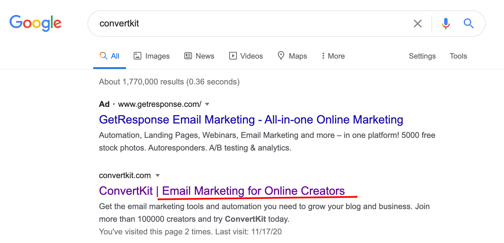

Method that i use to find the tagline

- Google the SaaS name and take look at their homepage / landing page description

- Read the interviews by the founder. Example [Nathan Barry interview in IndieHackers](https://www.indiehackers.com/podcast/008-nathan-barry-of-convertkit).

1. ConverKit - MailChimp for professional bloggers & creators; ConvertKit is the power of Infusionsoft but easier to use than MailChimp.

2. Buffer - Simpler social media tools for authentic engagement

3. TypeForm - People-friendly forms and surveys

4. Page Flows - user flow design inspiration - user flow design inspiration

This one is interesting because its research as a service ( productized service)

5. LinkMink - Affiliate Tracking and Management Software - Stripe Verified Partner

6. Poshmark - Poshmark is a fun and simple way to buy and sell fashion

This one is not a SaaS but really interesting to study.

7. Algolia - Site Search & Discovery powered by AI