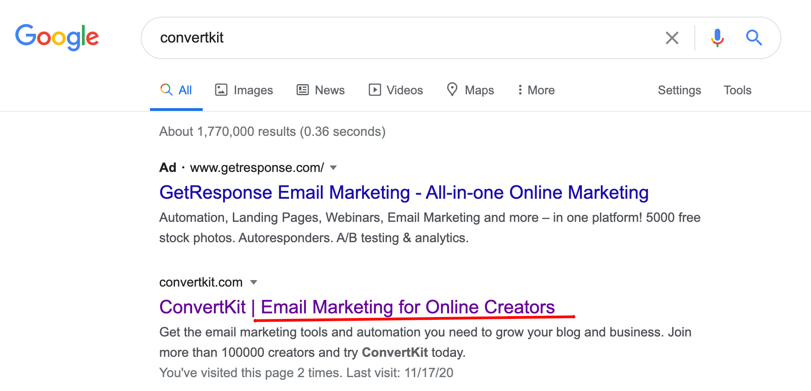

Method that i use to find catchprase

1. Google the SaaS name and take look at their homepage / landing page description

2. Read the interviews by the founder. Example [Nathan Barry interview in IndieHackers](https://www.indiehackers.com/podcast/008-nathan-barry-of-convertkit).

ConverKit ⇒ Email Marketing for Online Creators, MailChimp for professional bloggers & creators; ConvertKit is the power of Infusionsoft but easier to use than MailChimp.

Buffer ⇒ Simpler social media tools for authentic engagement.